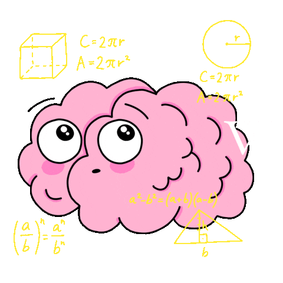
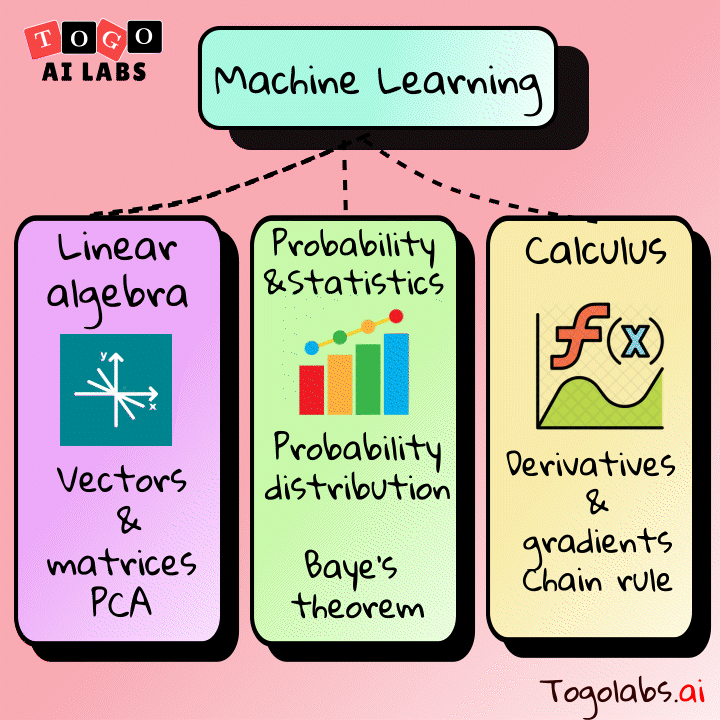

# Mathematics for Machine Learning and Artificial Intelligence

> A curated collection of mathematical concepts and worked examples that form the foundation of modern Machine Learning and Artificial Intelligence.


<div align="center">
 
  
</div>

---

## 📚 Table of Contents

- [Overview](#overview)
- [Topics Covered](#topics-covered)
- [Repository Structure](#repository-structure)
- [Getting Started](#getting-started)
- [Contributing](#contributing)
- [License](#license)

---

## Overview

This repository provides clear explanations and examples of the core mathematical disciplines required to understand and build ML/AI systems. Whether you are a beginner or looking to refresh your fundamentals, the material here covers the essential theory behind algorithms and models used in practice.

<div >
  
</div>
---

## Topics Covered

### 1. Linear Algebra
- Vectors and vector spaces
- Matrices and matrix operations
- Eigenvalues and eigenvectors
- Singular Value Decomposition (SVD)
- Principal Component Analysis (PCA)

### 2. Calculus
- Derivatives and partial derivatives
- Gradient, Jacobian, and Hessian
- Chain rule and backpropagation
- Optimization basics (gradient descent)

### 3. Probability & Statistics
- Probability distributions (Gaussian, Bernoulli, Multinomial)
- Bayes' theorem and Bayesian inference
- Expectation, variance, and covariance
- Maximum Likelihood Estimation (MLE)
- Hypothesis testing

### 4. Optimization
- Convex vs. non-convex optimization
- Gradient descent variants (SGD, Adam, RMSProp)
- Lagrange multipliers and constrained optimization

### 5. Information Theory
- Entropy and cross-entropy
- KL divergence
- Mutual information

---

## Repository Structure

```
Mathematics-for-Machine-Learning-and-Artificial-Intelligence/
├── images/          # Diagrams and visual aids
│   ├── 1.jpg
│   ├── 3.gif
│   ├── 4.gif
│   └── .gitkeep
├── README.md        # Project overview (this file)
└── LICENSE.txt      # MIT License
```

> 📌 Notebooks, problem sets, and additional resources will be added progressively. Check back often!

---

## Getting Started

No special installation is required to read the material in this repository. If interactive notebooks (Jupyter) are added in the future, you can run them by:

```bash
# Clone the repository
git clone https://github.com/EimanTahir071/Mathematics-for-Machine-Learning-and-Artificial-Intelligence.git
cd Mathematics-for-Machine-Learning-and-Artificial-Intelligence

# (Optional) Create and activate a virtual environment
python -m venv venv
source venv/bin/activate   # On Windows: venv\Scripts\activate

# (Optional) Install dependencies once a requirements.txt is added to the repo
# pip install -r requirements.txt

# Launch Jupyter
jupyter notebook
```

---

## Contributing

Contributions are welcome! To suggest an improvement or add new content:

1. Fork the repository
2. Create a new branch (`git checkout -b feature/your-topic`)
3. Commit your changes (`git commit -m 'Add explanation for topic X'`)
4. Push to the branch (`git push origin feature/your-topic`)
5. Open a Pull Request

Please ensure any added content is accurate, well-explained, and consistent with the style of existing material.

---

## License

This project is licensed under the **MIT License** — see the [LICENSE.txt](LICENSE.txt) file for details.
